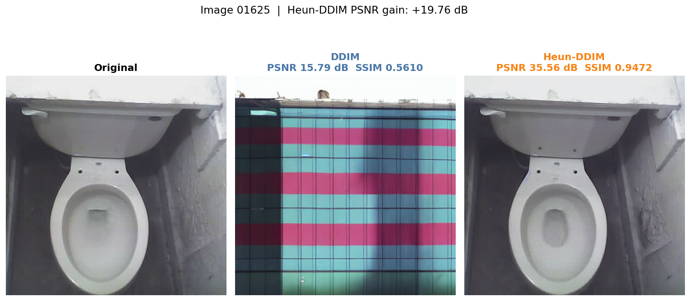
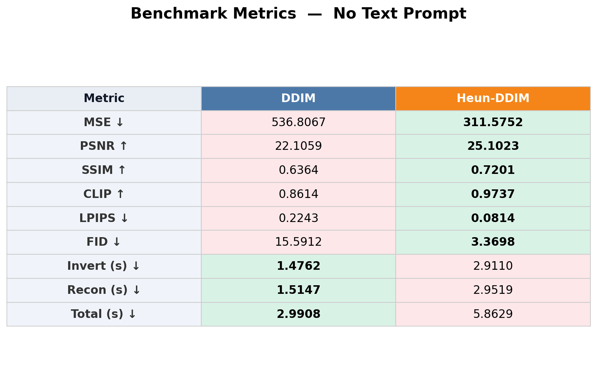
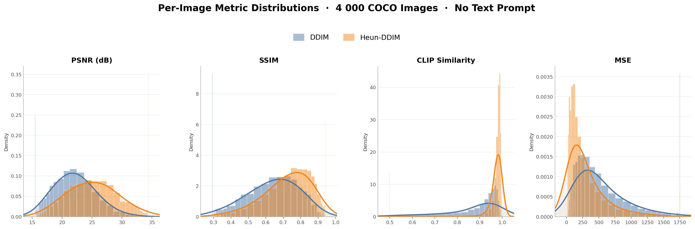
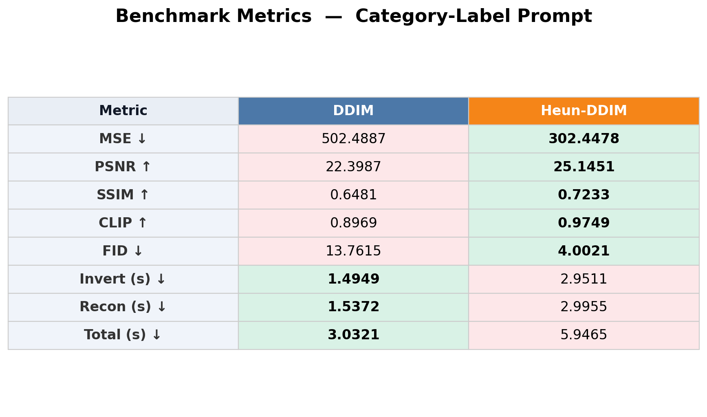
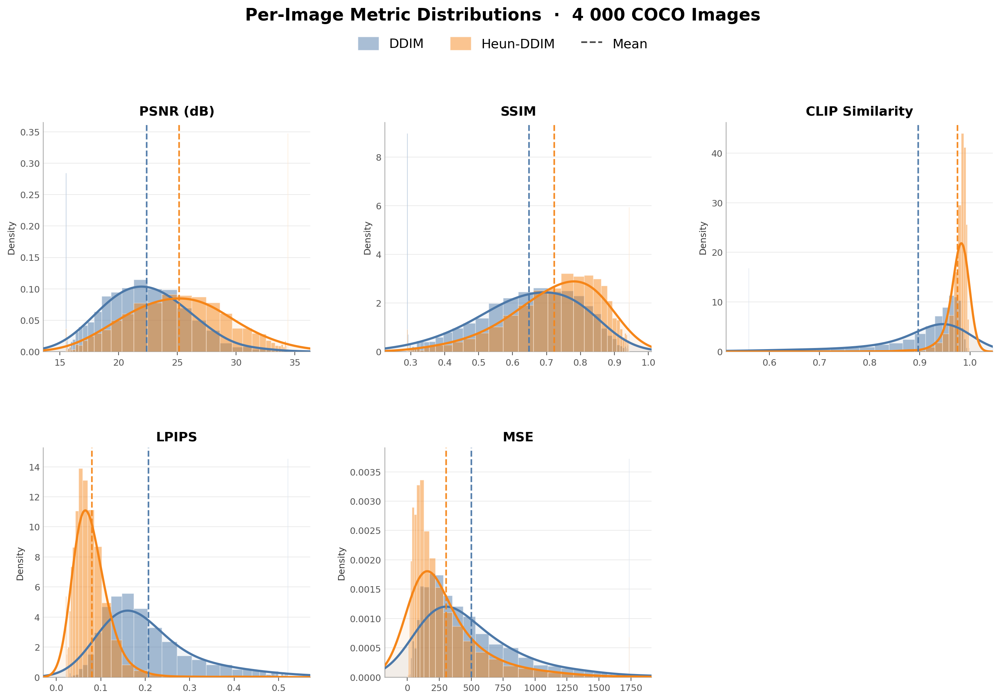
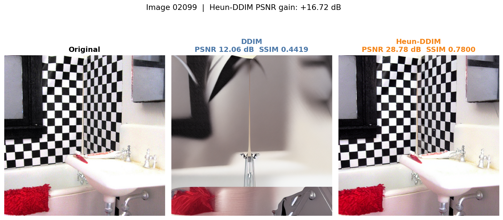
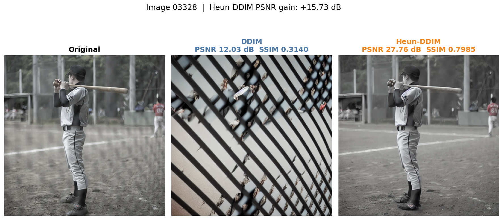
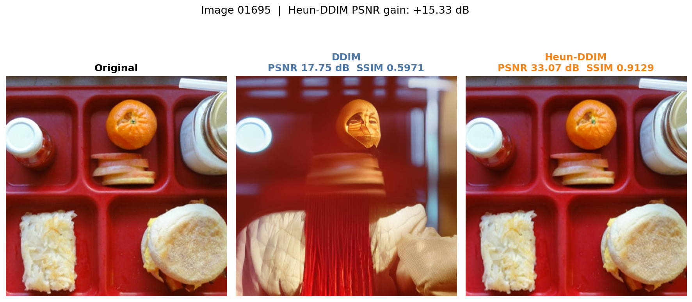
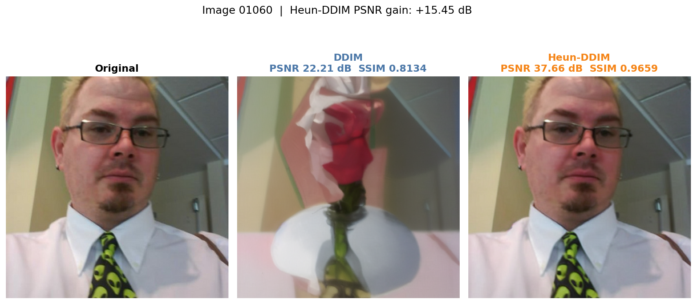
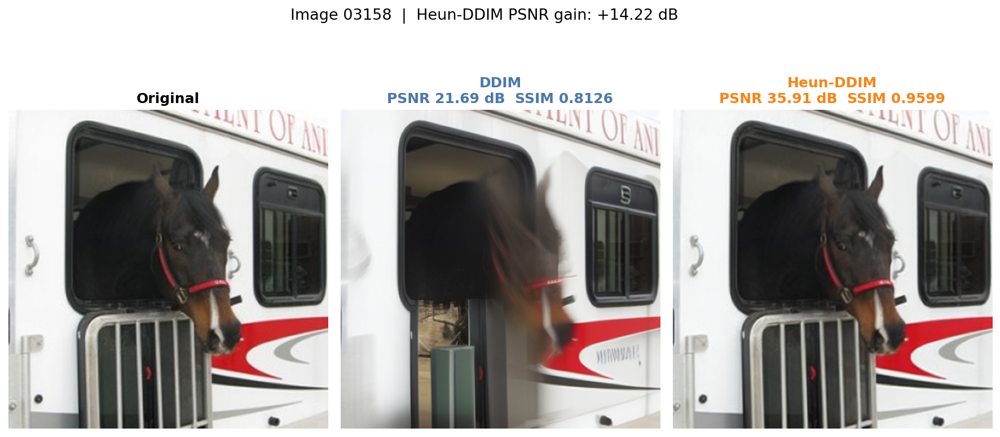

# Heun-DDIM: Second-Order Corrected DDIM Inversion for Stable Diffusion

[](https://www.python.org/downloads/)
[](LICENSE)
[](https://huggingface.co/stable-diffusion-v1-5/stable-diffusion-v1-5)

**Heun-DDIM** applies a predictor-corrector correction to DDIM inversion,
reducing round-trip reconstruction error with no changes to the model weights.
Evaluated on **4,000 COCO images** at 50 steps, it raises mean PSNR from
**22.1 → 25.1 dB**, CLIP similarity from **0.865 → 0.974**, and FID from
**18.0 → 4.1** under a fixed prompt.

---

## Teaser

<p align="center"></p>
<p align="center"><em>Left: original image.  Center: DDIM reconstruction.  Right: Heun-DDIM reconstruction.</em></p>

---

## Method

### The problem with DDIM inversion

DDIM inversion reverses the deterministic DDIM sampling process to map a real
image back into the noise space of the diffusion model.  The standard approach
treats the UNet score estimate at timestep *t* as constant over the entire
integration step — a first-order (Euler) approximation that accumulates
truncation error across all 50 steps.  The resulting noise code cannot be
perfectly decoded back to the original image.

### Heun correction

We apply the classical **Heun predictor-corrector** scheme to each inversion step:

```
# Predictor (standard DDIM step)
eps_t    = unet(z_t, t)
z0_pred  = (z_t - sqrt(1-a_t) * eps_t) / sqrt(a_t)
z_next   = sqrt(a_{t+1}) * z0_pred + sqrt(1-a_{t+1}) * eps_t

# Corrector (re-evaluate at predicted state, average scores)
eps_next = unet(z_next, t+1)
eps_avg  = (eps_t + eps_next) / 2

z0_corr  = (z_t - sqrt(1-a_t) * eps_avg) / sqrt(a_t)
z_next   = sqrt(a_{t+1}) * z0_corr + sqrt(1-a_{t+1}) * eps_avg
```

The averaged score is a second-order approximation of the true ODE velocity,
halving the local truncation error at the cost of one extra UNet forward pass
per step.  The same correction is applied symmetrically during reconstruction.

---

## Results

All experiments use Stable Diffusion 1.5, 512×512, 50 DDIM steps, 4,000 COCO 2017
images.  FID is computed with InceptionV3 pool_3 features (feature=2048).
Two prompt conditions are reported separately.

### Without-text inversion  (`"a photo"` prompt)

| Method    |   N   |  MSE ↓  | PSNR ↑ | SSIM ↑ | CLIP ↑ | FID ↓ | Total (s) |
|-----------|------:|--------:|-------:|-------:|-------:|------:|----------:|
| DDIM      | 4 000 | 530.77  | 22.10  | 0.6385 | 0.8648 | 18.04 | 3.03      |
| Heun-DDIM | 4 000 | **303.26** | **25.14** | **0.7230** | **0.9735** | **4.12** | 5.94 |

Δ PSNR = **+3.04 dB**  ·  Δ SSIM = **+0.085**  ·  FID reduction = **77 %**

<p align="center"></p>
<p align="center"><em>Metrics — No Text Prompt</em></p>

<p align="center"></p>
<p align="center"><em>Per-image distributions — No Text Prompt</em></p>

---

### With-text inversion  (COCO category-label prompt)

| Method    |   N   |  MSE ↓  | PSNR ↑ | SSIM ↑ | CLIP ↑ | FID ↓ | Total (s) |
|-----------|------:|--------:|-------:|-------:|-------:|------:|----------:|
| DDIM      | 4 000 | 502.49  | 22.40  | 0.6481 | 0.8969 | 13.76 | 3.03      |
| Heun-DDIM | 4 000 | **302.45** | **25.15** | **0.7233** | **0.9749** | **4.00** | 5.95 |

Δ PSNR = **+2.75 dB**  ·  Δ SSIM = **+0.075**  ·  FID reduction = **71 %**

<p align="center"></p>
<p align="center"><em>Metrics — Category-Label Prompt</em></p>

<p align="center"></p>
<p align="center"><em>Per-image distributions — Category-Label Prompt</em></p>

> Text prompts from COCO labels give DDIM a small boost (22.10 → 22.40 dB), but
> Heun-DDIM's advantage is consistent across both conditions.

### Visual comparisons

Top-6 images by Heun-DDIM PSNR improvement over DDIM.

<p align="center"></p>
<p align="center"></p>
<p align="center"></p>
<p align="center"></p>
<p align="center"></p>
<p align="center"></p>
<p align="center"><em>Left: original.  Center: DDIM.  Right: Heun-DDIM.</em></p>

---

## Quickstart

### 1. Install

```bash
git clone https://github.com/OmerBibi/heun-ddim
cd heun-ddim
pip install -r requirements.txt
```

### 2. Try the demo

Run both methods on the six bundled COCO example images and save comparison strips:

```bash
python demo.py
```

Results are written to `demo_output/`.  Each strip shows the original image,
the DDIM reconstruction, and the Heun-DDIM reconstruction side-by-side with
PSNR / SSIM annotations.  A metric summary table is printed to stdout:

```
Example      Method       PSNR     SSIM     CLIP
------------------------------------------------------------------------
example_01   DDIM         19.23    0.6102   0.8541
example_01   Heun-DDIM    38.99    0.9821   0.9991
  → saved demo_output/example_01.png  (Δ PSNR +19.76 dB)
...
```

---

## Scripts

### `invert.py` — invert an image to its noise latent

```bash
# Heun-DDIM inversion (recommended)
python invert.py --image photo.jpg --output latent.npz --method heun

# Standard DDIM inversion
python invert.py --image photo.jpg --output latent.npz --method ddim

# Both methods saved to a directory
python invert.py --image photo.jpg --output-dir latents/ --method both
```

The noise latent is saved as a compressed `.npz` file.  Pass `--prompt` to
use a custom text conditioning string (default: `"a photo"`).

---

### `reconstruct.py` — decode a latent back to an image

```bash
# Single latent → reconstructed image
python reconstruct.py --latent latent.npz --output recon.png

# With quality metrics against the original
python reconstruct.py \
    --latent   latent.npz \
    --original photo.jpg \
    --output   recon.png

# Side-by-side comparison strip from two latents
python reconstruct.py \
    --latent-ddim  latents/photo_ddim.npz \
    --latent-heun  latents/photo_heun.npz \
    --original     photo.jpg \
    --output       comparison.png
```

When `--original` is provided, PSNR / SSIM / CLIP scores are printed:

```
Quality metrics:
  DDIM          PSNR 22.10 dB  SSIM 0.6385  CLIP 0.8648  MSE 530.8
  Heun-DDIM     PSNR 25.14 dB  SSIM 0.7230  CLIP 0.9735  MSE 303.3
```

---

### `demo.py` — reproduce the README comparison figures

```bash
# Run all six bundled examples
python demo.py

# Run a single example
python demo.py --example 3

# Custom output directory and step count
python demo.py --output-dir results/ --steps 50
```

---

## Full inversion + reconstruction workflow

```bash
# Step 1 — invert with both methods
python invert.py \
    --image      photo.jpg \
    --output-dir latents/ \
    --method     both \
    --steps      50 \
    --prompt     "a photo"

# Step 2 — reconstruct and compare
python reconstruct.py \
    --latent-ddim  latents/photo_ddim.npz \
    --latent-heun  latents/photo_heun.npz \
    --original     photo.jpg \
    --output       comparison.png
```

---

## Citation

```bibtex
@misc{heun-ddim-2026,
  title  = {Heun-DDIM: Second-Order Corrected DDIM Inversion for Stable Diffusion},
  author = {Bibi, Omer and Adar, Yotam},
  year   = {2026},
  url    = {https://github.com/OmerBibi/heun-ddim},
}
```
